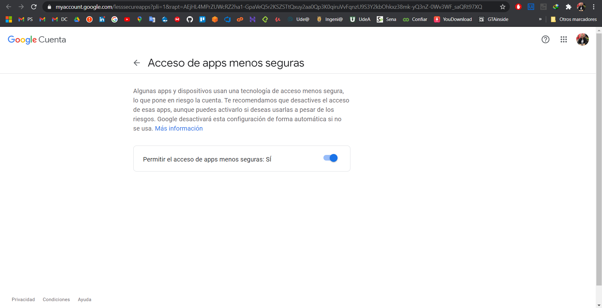
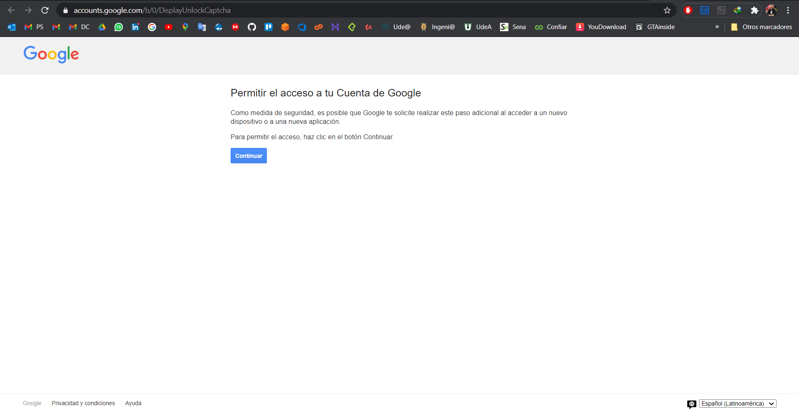
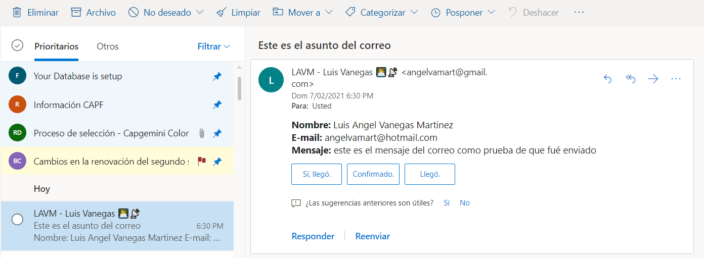

# Send Email with Node

## Initial Configuration [Local]

1. Create the `.env` file in the equal route of package.json with this:
```
PORT = 3000
PATH_API_SEND_EMAIL = /api/v1/sendEmail
SERVICE = gmail
EMAIL_SENDER = myemail@gmail.com
PASS_EMAIL_SENDER = my_password_of_email
```

2. change the "Less secure app access" in your gmail account from this direction: https://myaccount.google.com/lesssecureapps


3. accept unlock captcha in your email from this direction: https://accounts.google.com/b/0/DisplayUnlockCaptcha  be sure to change the number of URL for the number the you email, in my case is 0.



-----------------------
## Executing the API [Local]
1. Execute into the API
    ```
    npm install
    ```
2. Next, execute
    ```
    npm start
    ```
3. Open [http://localhost:3000](http://localhost:3000) in you browser.

------------------------
## Result of execution




------------------------
## Test the API in Postman

Import the script [test/test.postman.json](test/test.postman.json) into Postman


------------------------
## API Reference

### Send-Email
|Endpoint|Method|
|:--|:--|
|/api/v1/sendEmail/sendemail/|POST|

Sample Response
```json
{
    "accepted": [
        "angelvamart@hotmail.com"
    ],
    "rejected": [],
    "envelopeTime": 593,
    "messageTime": 720,
    "messageSize": 657,
    "response": "250 2.0.0 OK  1612740634 f26sm544531vsr.6 - gsmtp",
    "envelope": {
        "from": "angelvamart@hotmail.com",
        "to": [
            "angelvamart@hotmail.com"
        ]
    },
    "messageId": "<5cfea36a-1b35-3d54-9609-d0ab522cc77e@hotmail.com>"
}
```

